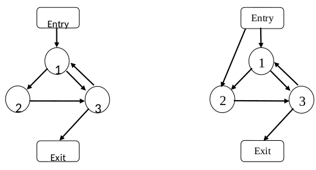

.. _`sec:BPatch_basicBlockLoop.h`:

BPatch_basicBlockLoop.h
#######################

.. cpp:class:: BPatch_basicBlockLoop
   
  **Loops composed of machine code basic blocks**

  .. cpp:member:: BPatch_basicBlockLoop* parent

    If loop which directly encloses this loop. NULL if no such loop

  .. cpp:function:: bool containsAddress(unsigned long addr)

    Return true if addr is contained within any of the basic blocks that
    compose this loop, excluding the block of any of its sub-loops.

  .. cpp:function:: bool containsAddressInclusive(unsigned long addr)

    Return true if addr is contained within any of the basic blocks that
    compose this loop, or in the blocks of any of its sub-loops.

  .. cpp:function:: int getBackEdges(std::vector<BPatch_edge *> &edges)

    Returns the number of back edges in this loop and adds those edges to
    the edges vector. An edge is a back edge if it is from a block in the
    loop to an entry block of the loop.

  .. cpp:function:: int getLoopEntries(std::vector<BPatch_basicBlock *> &entries)

    Returns the number of entry blocks of this loop and adds those blocks to
    the entries vector. An irreducible loop can have multiple entry blocks.

  .. cpp:function:: bool getContainedLoops(std::vector<BPatch_basicBlockLoop*>&)

    Fill the given vector with a list of the loops nested within this loop.

  .. cpp:function:: bool getOuterLoops(BPatch_Vector<BPatch_basicBlockLoop*> &loops)

    Fill the given vector with a list of the outer loops nested within this
    loop.

  .. cpp:function:: bool getLoopBasicBlocks(BPatch_Vector<BPatch_basicBlock*> &blocks)

    Fill the given vector with a list of all basic blocks that are part of
    this loop.

  .. cpp:function:: bool getLoopBasicBlocksExclusive(BPatch_Vector<BPatch_basicBlock*> &blocks)

    Fill the given vector with a list of all basic blocks that are part of
    this loop but not its sub-loops.

  .. cpp:function:: bool hasBlock(BPatch_basicBlock *b)

    Return true if this loop or any of its sub-loops contain b, false
    otherwise.

  .. cpp:function:: bool hasBlockExclusive(BPatch_basicBlock *b)

    Return true if this loop, excluding its sub-loops, contains b, false
    otherwise.

  .. cpp:function:: bool hasAncestor(BPatch_basicBlockLoop*)

    Return true if this loop is nested within the given loop (the given loop
    is one of its ancestors in the tree of loops).

  .. cpp:function:: BPatch_flowGraph * getFlowGraph()

    Returns the flow graph this loop is in

  .. cpp:function:: std::string format() const

Notes
=====

We detect both natural loops (single-entry loops)
and irreducible loops (multi-entry loops). For a natural loop, it has
only one entry block and this entry block dominates all blocks in the
loop; thus the entry block is also called the head or the header of the
loop. However, for an irreducible loop, it has multiple entry blocks and
none of them dominates all blocks in the loop; thus there is no head or
header for an irreducible loop. The following figure illustrates the
difference:

The left figure shows a natural loop, where block 1 represents the
single entry and block 1 is the head of the loop. Block 1 dominates
block 2 and block 3. The right figure shows an irreducible loop, where
block 1 and block 2 are the entries of the loop. Neither block 1 nor
block 2 dominates block 3.
