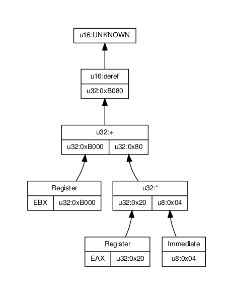

.. _`sec:Dereference.h`:

Dereference.h
#############

.. cpp:namespace:: Dyninst::InstructionAPI

.. cpp:class:: Dereference

  **Expression for an effective address**

  .. cpp:function:: Dereference(Expression::Ptr addr, Result_Type result_type)

    Constructs an expression representing the address to be dereferenced and a type
    indicating how the memory at the address in question is to be interpreted.

  .. cpp:function:: virtual void getChildren(vector<InstructionAST::Ptr>& children) const

    Appends the children of this :cpp:class:`Expression` node to ``children`` as an ``InstructionAST``.

    A ``Dereference`` has one child, which represents the address being dereferenced.

  .. cpp:function:: virtual void getChildren(vector<Expression::Ptr>& children) const

    Appends the children of this :cpp:class:`Expression` node to ``children`` as a generic ``Expression``.

    A ``Dereference`` has one child, which represents the address being dereferenced.

  .. cpp:function:: virtual void getUses(set<InstructionAST::Ptr>& uses)

    Appends the use set to ``uses``.

    The use set of a dereference is the same as the use set of the expression being dereferenced.

  .. cpp:function:: virtual bool isUsed(InstructionAST::Ptr i) const

    Checks if ``i`` is in this expression's used set.

    A expression is used if it is equivalent to the ``Dereference`` or it is
    used by the child of the ``Dereference``.

  .. cpp:function:: virtual std::string format(formatStyle) const

    Returns a string representation of this expression using the style ``formatStyle``.

  .. cpp:function:: virtual std::string format(Architecture arch, formatStyle) const

    Returns a string representation of this expression using the :cpp:class:`ArchSpecificFormatter`
    associated with ``arch``. ``formatStyle`` is ignored.

  .. cpp:function:: virtual bool bind(Expression* expr, const Result& value)

    Binds ``expr`` to ``value``.

  .. cpp:function:: virtual void apply(Visitor* v)

    Applies the visitor ``v``.

  .. cpp:function:: protected virtual bool isSameType(const InstructionAST& rhs) const

    Checks if ``rhs`` is a ``Dereference``.

  .. cpp:function:: protected virtual bool isStrictEqual(const InstructionAST& rhs) const

    Checks if this expression is the same as ``rhs``.

Notes
=====

It is not possible, given the information in a single instruction, to
evaluate the result of a dereference. :cpp:func:`eval` may still be called on an
expression that includes dereferences, but the expected use case is
as follows:

1. Determine the address being used in a dereference.

2. Perform analysis to determine the contents of that address.

3. If necessary, fill in the ``Dereference`` node with the contents of
   that addresss, using :cpp:func:`setValue`.

The type associated with a ``Dereference`` node will be the type of the
value *read from memory*, not the type used for the address
computation. Two ``Dereference``\ s that access the same address but
interpret the contents of that memory as different types will produce
different values. The children of a ``Dereference`` at a given address
are identical, regardless of the type of dereference being performed at
that address. For example, the expression shown in the figure below could
have its root ``Dereference``, which interprets the memory being
dereferenced as a unsigned 16-bit integer, replaced with a
``Dereference`` that interprets the memory being dereferenced as any
other type. The remainder of the expression tree would, however,
remain unchanged.

  Applying eval to a Dereference tree with two registers having user-provided values.
