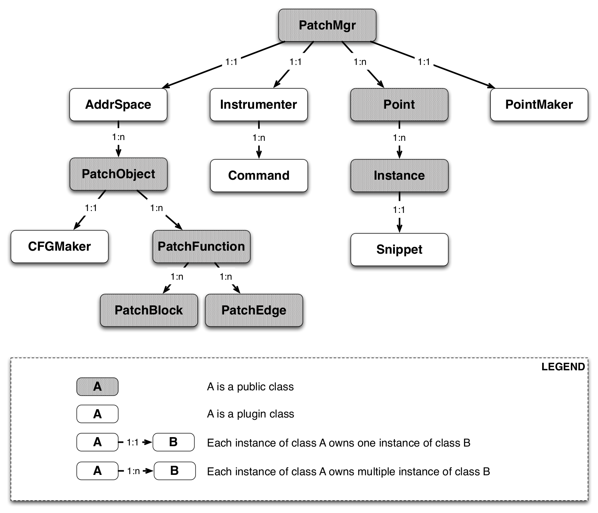
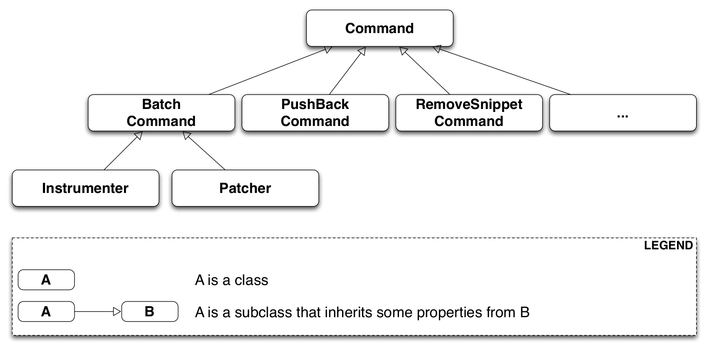

.. _`sec:patchapi-intro`:

.. cpp:namespace:: Dyninst::PatchAPI

PatchAPI
########

PatchAPI is a library for binary code patching. It provides a thin layer on top of ParseAPI’s Control Flow Graph
(:ref:`CFG <sec:CFG.h>`) layer, which associates some useful information for the ease of
binary code patching, for example, a shared library’s load address.
PatchAPI can instrument (insert code into) and modify a binary executable or library by
annotating this CFG with :cpp:class:`snippets <Snippet>`. It is designed to
be flexible and extensible by using :ref:`plugins <sec:parseapi-plugin-interface>`
to handle new types of instrumentation, different binary types, or different patching techniques.

Users instrument the binary by annotating this CFG using three
additional high-level abstractions: Point, Snippet, and Instance. A
Point supports instrumentation by representing a particular aspect of
program behavior (e.g., entering a function or traversing an edge) and
containing instances of Snippets. Point lookup is performed with a
single PatchAPI manager (PatchMgr) object by Scope (e.g., a CFG object)
and Type (e.g., function entry). In addition, a user may provide an
optional Filter that selects a subset of matching Points. A Snippet
represents a sequence of code to be inserted at certain points. To
maximize flexibility, PatchAPI does not prescribe a particular snippet
form; instead, users may provide their own (e.g., a binary buffer, a
Dyninst abstract syntax tree (AST), or code written in the DynC language).
Users instrument the binary by adding Snippets to the desired Points. An
Instance represents the insertion of a particular Snippet at a
particular Point.

The core PatchAPI representation of an annotatable and modifiable CFG
operates in several domains, including on a running process (dynamic
instrumentation) or a file on disk (binary rewriting). Furthermore,
PatchAPI may be used both in the same address space as the process
(1st-party instrumentation) or in a different address space via the
debug interface (3rd-party instrumentation). Similarly, developers may
define their own types of Snippets to encapsulate their own code
generation techniques. These capabilities are provided by a plugin
interface; by implementing a plugin a developer may extend PatchAPI’s
capabilities.

.. _`sec:patchapi-abstractions`:

Abstractions
************

PatchAPI contains two interfaces: the public interface and the plugin
interface. The public interface is used to find instrumentation points,
insert or delete code snippets, and register plugins provided by
users. The plugin interface is used to customize different aspects
in the binary code patching. PatchAPI provides a set of default plugins
for first party code patching, which is easy to extend to meet different
requirements in practice.

Public Interface
================

PatchMgr
  :cpp:class:`PatchMgr` is the top-level resource for finding
  instrumentation :cpp:class:`Point`\ s, inserting or deleting :cpp:class:`Snippet`\ s, and
  registering user-provided plugins.

Point
  A :cpp:class:`Point` exists at a specific :cpp:class:`Location` on the CFG that acts
  as a container of inserted snippet :cpp:class:`Instance`\ s. Points of different
  types are distinct even the underlying code relocation and generation
  engine happens to put instrumentation from them at the same place.

Instance
  An :cpp:class:`Instance` is a specific :cpp:class:`Snippet` inserted at a :cpp:class:`Point`.

PatchObject
  A :cpp:class:`PatchObject` wraps a :cpp:class:`ParseAPI::CodeObject`, and
  represents an individual binary code object such as an executable or a library.

PatchFunction
  A :cpp:class:`PatchFunction` wraps a :cpp:class:`ParseAPI::Function`.

PatchBlock
    A :cpp:class:`PatchBlock` wraps a :cpp:class:`ParseAPI::Block`.

PatchEdge
  A :cpp:class:`PatchEdge` wraps a :cpp:class:`ParseAPI::Edge`. It joins
  two basic blocks in the CFG and indicatines the type of control flow
  transfer instruction that joins the basic blocks to each other.

PatchLoop
  A :cpp:class:`PatchLoop` wrap a :cpp:class:`ParseAPI::Loop <ParseAPI::dev::Loop>` representing
  a piece of code that may execute repeatedly. There are two types of loops:
  A **natural** loop has a single entry block and an **irreducible** loop
  has multiple.

PatchLoopTreeNode
  A :cpp:class:`PatchLoopTreeNode` wraps a :cpp:class:`ParseAPI::LoopTreeNode <ParseAPI::dev::LoopTreeNode>` and
  provides a tree interface to a collection of :cpp:class:`PatchLoop`\ s.
  The structure of the tree follows the nesting relationship of the
  loops in a function.

AddrSpace
  An :cpp:class:`AddrSpace` is the address space of a mutatee (a program that is instrumented)
  and contains a collection of :cpp:class:`PatchObject`\ s that represents a number of shared
  libraries or a binary executable.

Snippet
  A :cpp:class:`Snippet` is an abstract representation of language-level constructs
  that can be inserted into the CFG and later rendered into platform-specific binary code.

CFGMaker
  A :cpp:class:`CFGMaker` is a factory that constructs a CFG.

PointMaker
  A :cpp:class:`PointMaker` is a factory that creates any type of :cpp:class:`Point`.

   Relationships between the public interface types

Note that some relationships are ``1:1`` and some are ``1:N``. For example,
each :cpp:class:`PatchMgr` contains exactly one AddrSpace, but a
:cpp:class:`PatchMgr` contains more than one :cpp:class:`Point`.

.. _`sec:parseapi-plugin-interface`:

Plugin Interface
================

The implementation of an instrumentation engine may be very
sophisticated (e.g., relocating a function), or very simple (e.g.,
simply overwrite an instruction). Therefore, PatchAPI provides a
flexible framework for programmers to customize the instrumentation
engine. This framework is based on the Command pattern. The
instrumentation engine has transactional semantics where all
instrumentation requests should succeed or all should fail. The
:cpp:class:`Command` abstraction represents an instrumentation
request or a logical step in the code patching process. Lists of commands
are accumulated and then executed one-by-one. If one command
fails, all preceding commands are rolled back.

Command
  A :cpp:class:`Command` is an instrumentation request
  (e.g., snippet insertion or removal), or a logical step in the code
  patching (e.g., install instrumentation). :cpp:func:`Command::run`
  executes the sequence of requests, and :cpp:func:`Command::undo`
  undoes that execution.

BatchCommand
  A :cpp:class:`BatchCommand` is a :cpp:class:`Command` that aggregates
  a sequence of commands and then executes them on request.

Instrumenter
  An :cpp:class:`Instrumenter` encapsulates the core code patching logic,
  including binary code generation.

Patcher
  A :cpp:class:`Patcher` aaccepts instrumentation requests from users
  and implicitly adds them to the end of the sequence of commands to
  execute.

   Relationships between the plugin interface types

.. _`sec:patchapi-usage`:

Usage
*****

Public interface
================

The basic flow of doing code patching is to first find some points in a
program, and then to insert, delete or update a piece of code at these
points.

CFG Traversal
^^^^^^^^^^^^^

..
  rli:: https://raw.githubusercontent.com/dyninst/examples/master/patchAPI/CFGTraversal.cpp
  :language: cpp
  :linenos:

Finding Points
^^^^^^^^^^^^^^

..
  rli:: https://raw.githubusercontent.com/dyninst/examples/master/patchAPI/findingPoints.cpp
  :language: cpp
  :linenos:

Patching Code
^^^^^^^^^^^^^

..
  rli:: https://raw.githubusercontent.com/dyninst/examples/master/patchAPI/nopPatching.cpp
  :language: cpp
  :linenos:

Plugin interface
================

Address Space
^^^^^^^^^^^^^

This implements the address space plugin to manage memory. The instrumentation engine will
utilize these memory management methods during the code patching process. For example, the
instrumentation engine needs to malloc a buffer in a mutatee’s address space
and then write the code snippet into this buffer.

..
  rli:: https://raw.githubusercontent.com/dyninst/examples/master/patchAPI/addressSpace.cpp
  :language: cpp
  :linenos:

Custom CFG Generator
^^^^^^^^^^^^^^^^^^^^

..
  rli:: https://raw.githubusercontent.com/dyninst/examples/master/patchAPI/CFGMaker.cpp
  :language: cpp
  :linenos:

Making Points
^^^^^^^^^^^^^

..
  rli:: https://raw.githubusercontent.com/dyninst/examples/master/patchAPI/PointMaker.cpp
  :language: cpp
  :linenos:

Binary Modification
===================

PatchAPI provides binary modification with a :cpp:class:`PatchModifier`
to manipulate the CFG. The three key benefits of the PatchAPI modification interface are
abstraction, safety, and interactivity. We use the CFG as a mechanism
for transforming binaries in a platform-independent way that requires no
instruction-level knowledge by the user. These transformations are
limited to ensure that the CFG can always be used to instantiate code,
and thus the user can avoid unintended side-effects of modification.
Finally, modifications to the CFG are represented in that CFG, allowing
users to iteratively combine multiple CFG transformations to achieve
their goals.

..
  rli:: https://raw.githubusercontent.com/dyninst/examples/master/patchAPI/PatchModifier.cpp
  :language: cpp
  :linenos:

Since modification can modify the CFG, it may invalidate previous analyses
performed over the CFG. It is strongly suggested that users take
advantage of the callback interface to update analysis information as the
CFG changes.

