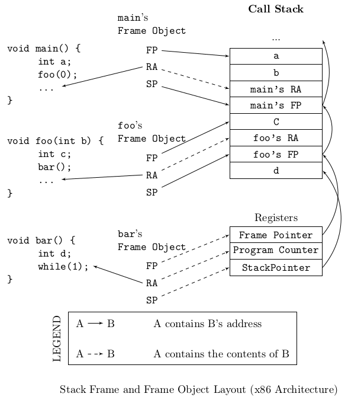
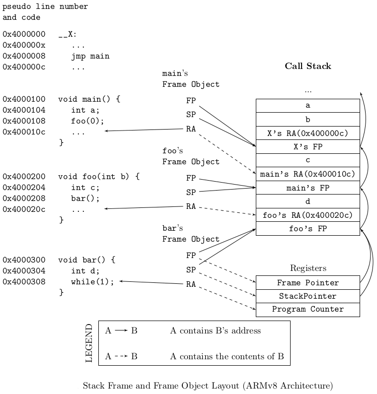

.. _`sec:stackwalk-intro`:

.. cpp:namespace:: Dyninst::Stackwalker

Stackwalker
###########

Stackwalker is a library that allows users to collect a call stack (known as walking the
call stack) and access information about its stack frames.

The call stack (also known as the run-time stack) is a stack found in a process that contains
the currently-active stack frames. Each stack frame is a record of an executing
function (or function-like object such as a signal handler or system call).

Stackwalker contains two interfaces: the :ref:`sec:stackwalker-stackwalking-interface` and
the :ref:`sec:stackwalker-callback-interface`. Users can easily use the stackwalking interface
to walk a call stack without needing to understand how call stacks are laid out on their platform.
Users can use the Callback Interface to extend Stackwalker to work with new platforms and types of
stack frames by implementing a set of callbacks.

.. _`sec:stackwalk-abstractions`:

Abstractions
************

Stack Frame
   A stack :cpp:class:`frame <Frame>` is an *immutable* snapshot of a record of a
   function (or function-like object) invocation at a specific point in time.
   Even if a captured stack frame changes as a process executes, the corresponding
   ``Frame`` object will remain **unchanged**. Stackwalker finds stack frames and
   returns a description of them when it walks a call stack.

Bottom of the Stack
   The bottom of the stack is the earliest stack frame in a call stack,
   usually a thread’s initial function. The stack grows from bottom to
   the top.

Top of the Stack
   The top of the stack is the most recent stack frame in a call stack.
   The stack frame at the top of the stack is for the currently
   executing function.

Target Process
   The process from which Stackwalker is collecting stackwalks.

Host Process
   The process in which Stackwalker code is currently running.

.. _`topic:stackwalk-first-party`:

First Party Stackwalk
   Stackwalker collects first party stackwalk when it walks a call
   stack in the same address space it is running in, i.e. the target
   process is the same as the host process. :cpp:class:`ProcSelf`
   is used for first-party stackwalks.

.. _`topic:stackwalk-third-party`:

Third Party Stackwalk
   Stackwalker collects third party stackwalk when it walks the call
   stack in a different address space from the one it is running in,
   i.e. the target process is different from the host process.
   :cpp:class:`ProcDebug` is used for third-party stackwalks.

.. _`sec:stackwalker-stackwalking-interface`:

Stackwalking Interface
**********************
The stackwalking interface is used to walk the call stack, query information
about stack frames, and collect basic information about threads.

Walker
   The :cpp:class:`Walker` class is the top-level class used for collecting
   stackwalks. It provides a simple interface for requesting a
   stackwalk. Each Walker object is associated with one process, but may
   walk the call stacks of multiple threads within that process.

SP (Stack Pointer)
   A frame’s SP member points to the top of its stack frame (a
   stack frame grows from bottom to top, similar to a call stack). The
   frame for the top of the stack has a SP that is equal to the
   value in the stack pointer register at the time the frame was
   created. The frame for any other stack frame has a SP that is
   equal to the top address in the stack frame.

FP (Frame Pointer)
   A frame’s FP member points to the beginning (or bottom) of its
   stack frame. The frame for the top of the stack has a FP that
   is equal to the value in the frame pointer register at the time the
   frame was created. The frame for any other stack frame
   has a FP that is equal to the beginning of the stack frame.

RA (Return Address)
   A frame’s RA member points to the location in the code space
   where control will resume when the function that created the stack
   frame resumes. The frame for the top of the stack has a RA
   that is equal to the value in the program counter register at the
   time the frame was created. The frame for any other
   stack frame has a RA that is found when walking a call stack.

x86 Call Frame
==============

.. _stackwalk-framelayout-x86:

  x86 frame layout

:ref:`stackwalk-framelayout-x86` shows the relationship between
application code, stack frames, and Frame objects. In the figure, the
source code on the left has run through the main and foo functions, and
into the bar function. It has created the call stack in the center,
which is shown as a sequence of words growing down. The current values
of the processor registers, while executing in bar, are shown below the
call stack. When Stackwalker walks the call stack, it creates the
Frame objects shown on the right. Each Frame object corresponds to one
of the stack frames found in the call stack or application registers.

aarch64 Call Frame
==================

.. _stackwalk-framelayout-ARMv8:

  ARMv8 frame layout

The ARMv8 call stack in :ref:`stackwalk-framelayout-ARMv8` is similar to
one that would be found on the x86 architecture. Details about how the
call stack is laid out may be different on other architectures, but the
meanings of the FP, SP, and RA fields in the Frame objects will remain
the same.

.. _`sec:stackwalker-callback-interface`:

Callback Interface
******************
The Callback Interface is used to provide custom mechanisms for walking a call stack.

Stackwalker includes default implementations of the Callback Interface on each of its
supported platforms. These default implementations allow Stackwalker to work
"out of the box" in a standard configuration on each platform. The mechanics of how to
walk through a stack frame can vary between different platforms, and even between
different types of stack frames on the same platform. In addition, different platforms
may have different mechanisms for reading the data in a call stack or looking up symbolic
names that go with a stack frame.

Users can port Stackwalker to new platforms or customize its call stack walking behavior by
implementing their own versions of the classes in the Callback Interface.

FrameStepper
  A :cpp:class:`FrameStepper` describes how to walk through a single type of
  stack frame. Users can provide an implementation of this interface
  that allows Stackwalker to walk through new types of stack frames.
  For example, the DyninstAPI uses this interface to extend
  Stackwalker to allow it to walk through stack frames created by
  instrumentation code.

StepperGroup
  A :cpp:class:`StepperGroup` is a collection of FrameStepper objects and criteria
  that describes when to use each type of FrameStepper. These criteria
  are based on simple address ranges in the code space of the target
  process.

ProcessState
  A :cpp:class:`ProcessState` describes how to access data in the target
  process. To walk a call stack, Stackwalker needs to access both
  registers and memory in the target process; ProcessState provides an
  interface that Stackwalker can use to access that information.
  Stackwalker provides two default types of ``ProcessState`` objects:
  ``ProcSelf`` does a first party stackwalk, and ``ProcDebug`` does
  a third party stackwalk.

SymbolLookup
  The :cpp:class:`SymbolLookup` interface is used to associate a symbolic name with
  a stack frame. A stackwalk returns a collection of addresses in the
  code space of a binary. This class uses the binary’s symbol table to
  map those addresses into symbolic names. The default implementation
  uses :ref:`sec:symtab-intro`.

Walk through a stack frame
==========================
Stackwalker will find different types of stack frames on different
platforms and even within the same platform. For example, on
Linux/x86 the stack frame generated by a typical function looks
different from the stack frame generated by a signal handler. The
callback interface can be used to register a handler with
Stackwalker that knows how to walk through a new type of stack
frame. For example, the DyninstAPI tool registers an object with
Stackwalker that describes how to walk through the stack frames
generated by its instrumentation.

Users can create their own ``FrameStepper`` classes. A new
``FrameStepper`` object must be added to a ``StepperGroup`` before it
can be used. Stackwalker ships with numerous default implementations of the
``FrameStepper`` class. Each of these ``FrameStepper`` implementations
allow Stackwalker to walk a type of call frames.

Several of the ``FrameStepper``\ s use helper classes (see
``FrameFuncStepper`` as an example). Users can further customize the
behavior of a ``FrameStepper`` by providing their own implementation of
these helper classes.

Access process data
===================
To walk a call stack, Stackwalker uses a :cpp:class:`ProcessState` to be able to read a
process’ memory and registers. When doing a first party stackwalk,
this is done by directly reading them from the current address space.
When doing a third party stackwalk, this is done by reading them
using a debugger interface. The callback interface can be used to
register new objects for accessing process data. This can be used,
for example, to port Stackwalker to a new operating system or make
it work with a new debugger interface.

Look up symbolic names
======================
When Stackwalker finds a stack frame, it gets an address that
points into the piece of code that created that stack frame. This
address is not necessarily meaningful to a user, so Stackwalker
attempts to associate the address with a symbolic name using :cpp:class:`SymbolLookup`. The callback
interface can be used to register an object with Stackwalker that
performs an address to name mapping, allowing Stackwalker to
associate names with stack frames.

Default Implementations
=======================

.. table:: Callback Interface Defaults

  +--------------+--------------+--------------+--------------+-------------------------+
  |              | StepperGroup | ProcessState | SymbolLookup | FrameStepper            |
  +==============+==============+==============+==============+=========================+
  | Linux/x86    | 1. AddrRange | 1. ProcSelf  | 1. SwkSymtab | 1. FrameFuncStepper     |
  +--------------+--------------+--------------+--------------+-------------------------+
  | Linux/x86-64 |              | 2. ProcDebug |              | 2. SigHandlerStepper    |
  +--------------+--------------+--------------+--------------+-------------------------+
  |              |              |              |              | 3. DebugStepper         |
  +--------------+--------------+--------------+--------------+-------------------------+
  |              |              |              |              | 4. AnalysisStepper      |
  +--------------+--------------+--------------+--------------+-------------------------+
  |              |              |              |              | 5. StepperWanderer      |
  +--------------+--------------+--------------+--------------+-------------------------+
  |              |              |              |              | 6. BottomOfStackStepper |
  +--------------+--------------+--------------+--------------+-------------------------+
  | Linux/PPC    | 1. AddrRange | 1. ProcSelf  | 1. SwkSymtab | 1. FrameFuncStepper     |
  +--------------+--------------+--------------+--------------+-------------------------+
  | Linux/PPC-64 |              | 2. ProcDebug |              | 2. SigHandlerStepper    |
  +--------------+--------------+--------------+--------------+-------------------------+
  |              |              |              |              | 3. AnalysisStepper      |
  +--------------+--------------+--------------+--------------+-------------------------+
  | Windows/x86  | 1. AddrRange | 1. ProcSelf  | 1. SwkSymtab | 1. FrameFuncStepper     |
  +--------------+--------------+--------------+--------------+-------------------------+
  |              |              | 2. ProcDebug |              | 2. AnalysisStepper      |
  +--------------+--------------+--------------+--------------+-------------------------+
  |              |              |              |              | 3. StepperWanderer      |
  +--------------+--------------+--------------+--------------+-------------------------+
  |              |              |              |              | 4. BottomOfStackStepper |
  +--------------+--------------+--------------+--------------+-------------------------+

Usage
*****

Stackwalker’s ease-of-use comes from it providing a platform
independent interface that allows users to access detailed information
about the call stack. For example, the following C++ code-snippet is all
that is needed to walk and print the call stack of the currently running
thread.

.. rli:: https://raw.githubusercontent.com/dyninst/examples/master/stackwalker/this_thread.cpp
   :language: cpp
   :linenos:

Stackwalker can walk a call stack in the same address space as where the Stackwalker library lives
(known as a first party stackwalk), or it can walk a call stack in another process (known as a third party
stackwalk). The easiest way to get at a :cpp:class:`ProcDebug` is to cast the return value of
:cpp:func:`Walker::getProcessState`.

.. rli:: https://raw.githubusercontent.com/dyninst/examples/master/stackwalker/determineWalkerParty.cpp
  :language: cpp
  :linenos:

.. _`topic:stackwalker-debugger`:

Stackwalker as a Debugger
=========================

This section describes how to use Stackwalker for collecting 3rd
party stack walks. In 3rd party mode Stackwalker uses the OS’s
debugger interface to connect to another process and walk its call
stacks. As part of being a debugger Stackwalker receives and needs to
handle debug events. When a debugger event occurs, Stackwalker must
get control of the host process in order to receive the debugger event
and continue the target process.

To illustrate the complexities with running in 3rd party mode, consider
the follow code snippet that uses Stackwalker to collect a stack walk
every five seconds.

.. rli:: https://raw.githubusercontent.com/dyninst/examples/master/stackwalker/simple3rdPartyWalk.cpp
  :language: cpp
  :linenos:

Stackwalker is running in 3rd party mode, since it attached to the
target process with id ``pid``. As the target process runs it may be generating
debug events such a thread creation and destruction, library loads and
unloads, signals, forking/execing, etc. When one of these debugger
events is generated the OS will pause the target process and send a
notice to the host process. The target process will remain paused until
the host process handles the debug event and resumes the target process.

Here, the host process is spending almost all of its time
in the sleep call. If a debugger event happens during the sleep, then
Stackwalker will not be able to get control of the host process and
handle the event for up to five seconds. This will cause long pauses in
the target process and lead to a potentially very large slowdown.

To work around this problem Stackwalker provides a notification file
descriptor. This file descriptor represents a connection between the
Stackwalker library and user code. Stackwalker will write a single
byte to this file descriptor when a debug event occurs, thus notifying
the user code that it needs to let Stackwalker receive and handle
debug events. The user code can use system calls such as select to watch
for events on the notification file descriptor.

The following example illustrates how to more carefully use Stackwalker to
collect a stack walk from another process at a five second interval.

.. rli:: https://raw.githubusercontent.com/dyninst/examples/master/stackwalker/complex3rdPartyWalk.cpp
  :language: cpp
  :linenos:
