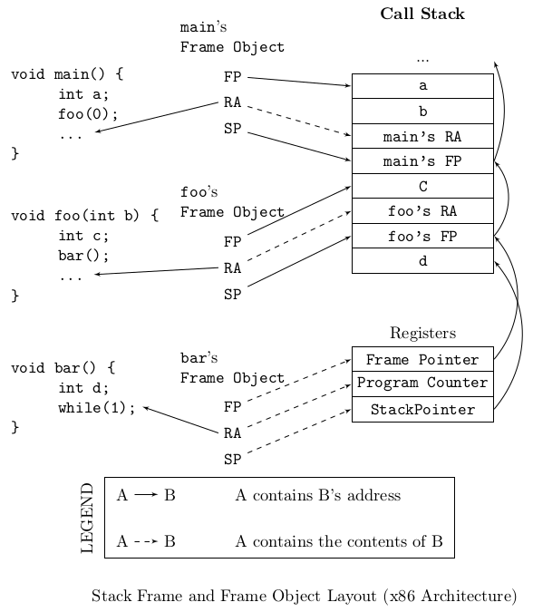
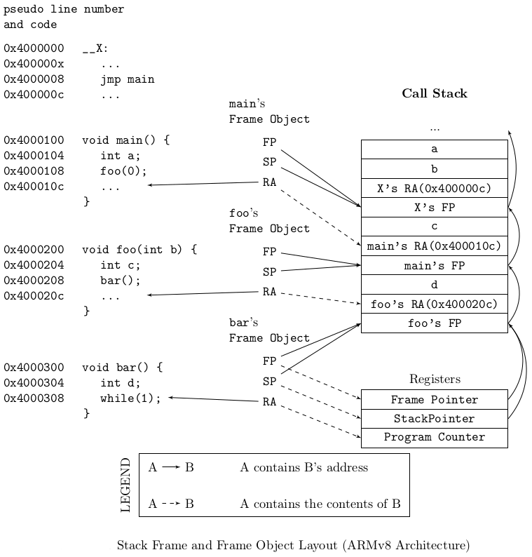

.. _`sec:stackwalk-intro`:

.. cpp:namespace:: Dyninst::Stackwalker

Stackwalker
###########

Stackwalker is a library for walking a call stack. The call stack
(also known as the run-time stack) is a stack
found in a process that contains the currently-active stack frames. Each
stack frame is a record of an executing function (or function-like
object such as a signal handler or system call). StackwalkerAPI provides
an API that allows users to collect a call stack (known as walking the
call stack) and access information about its stack frames. The current
implementation supports Linux/x86, Linux/x86-64, Linux/Power-64, and Windows/x86.

StackwalkerAPI is designed to be both easy-to-use and easy-to-extend.
Users can easily use StackwalkerAPI to walk a call stack without needing
to understand how call stacks are laid out on their platform. Users can
easily extend StackwalkerAPI to work with new platforms and types of
stack frames by implementing a set of callbacks that can be plugged into
StackwalkerAPI.

.. _`sec:stackwalk-abstractions`:

Abstractions
============

StackwalkerAPI contains two interfaces: the Stackwalking Interface and
the Callback Interface. The stackwalking interface is used to walk the
call stack, query information about stack frames, and collect basic
information about threads. The Callback Interface is used to provide
custom mechanisms for walking a call stack. Users who operate in one of
StackwalkerAPI’s standard configurations do not need to use the Callback
Interface.

Definitions
-----------

Stack Frame
   A stack frame is a record of a function (or function-like object)
   invocation. When a function is executed, it may create a frame on the
   call stack. StackwalkerAPI finds stack frames and returns a
   description of them when it walks a call stack. The following three
   definitions deal with stack frames.

Bottom of the Stack
   The bottom of the stack is the earliest stack frame in a call stack,
   usually a thread’s initial function. The stack grows from bottom to
   the top.

Top of the Stack
   The top of the stack is the most recent stack frame in a call stack.
   The stack frame at the top of the stack is for the currently
   executing function.

Frame Object
   A Frame object is StackwalkerAPI’s representation of a stack frame. A
   Frame object is a snapshot of a stack frame at a specific point in
   time. Even if a stack frame changes as a process executes, a Frame
   object will remain the same. Each Frame object is represented by an
   instance of the Frame class.

The following three definitions deal with fields in a Frame object.

SP (Stack Pointer)
   A Frame object’s SP member points to the top of its stack frame (a
   stack frame grows from bottom to top, similar to a call stack). The
   Frame object for the top of the stack has a SP that is equal to the
   value in the stack pointer register at the time the Frame object was
   created. The Frame object for any other stack frame has a SP that is
   equal to the top address in the stack frame.

FP (Frame Pointer)
   A Frame object’s FP member points to the beginning (or bottom) of its
   stack frame. The Frame object for the top of the stack has a FP that
   is equal to the value in the frame pointer register at the time the
   Frame object was created. The Frame object for any other stack frame
   has a FP that is equal to the beginning of the stack frame.

RA (Return Address)
   A Frame object’s RA member points to the location in the code space
   where control will resume when the function that created the stack
   frame resumes. The Frame object for the top of the stack has a RA
   that is equal to the value in the program counter register at the
   time the Frame object was created. The Frame object for any other
   stack frame has a RA that is found when walking a call stack.

.. _stackwalk-framelayout-x86:

  x86 frame layout

:ref:`stackwalk-framelayout-x86` shows the relationship between
application code, stack frames, and Frame objects. In the figure, the
source code on the left has run through the main and foo functions, and
into the bar function. It has created the call stack in the center,
which is shown as a sequence of words growing down. The current values
of the processor registers, while executing in bar, are shown below the
call stack. When StackwalkerAPI walks the call stack, it creates the
Frame objects shown on the right. Each Frame object corresponds to one
of the stack frames found in the call stack or application registers.

.. _stackwalk-framelayout-ARMv8:

  ARMv8 frame layout

The ARMv8 call stack in :ref:`stackwalk-framelayout-ARMv8` is similar to
one that would be found on the x86 architecture. Details about how the
call stack is laid out may be different on other architectures, but the
meanings of the FP, SP, and RA fields in the Frame objects will remain
the same.

The following four definitions deal with processes involved in
StackwalkerAPI.

Target Process
   The process from which StackwalkerAPI is collecting stackwalks.

Host Process
   The process in which StackwalkerAPI code is currently running.

.. _`topic:stackwalk-first-party`:

First Party Stackwalk
   StackwalkerAPI collects first party stackwalk when it walks a call
   stack in the same address space it is running in, i.e. the target
   process is the same as the host process.

.. _`topic:stackwalk-third-party`:

Third Party Stackwalk
   StackwalkerAPI collects third party stackwalk when it walks the call
   stack in a different address space from the one it is running in,
   i.e. the target process is different from the host process. A third
   party stackwalk is usually done through a debugger interface.

Stackwalking Interface
----------------------

Walker
   The Walker class is the top-level class used for collecting
   stackwalks. It provides a simple interface for requesting a
   stackwalk. Each Walker object is associated with one process, but may
   walk the call stacks of multiple threads within that process.

Frame
   A call stack is returned as a vector of Frame objects, where each
   Frame object represents a stack frame. It can provide information
   about the stack frame and basic information about the function,
   signal handler or other mechanism that created it. Users can request
   information such as the symbolic name associated with the Frame
   object, and values of its saved registers.

Stackwalk Callback Interface
----------------------------

StackwalkerAPI includes default implementations of the Callback
Interface on each of its supported platforms. These default
implementations allow StackwalkerAPI to work "out of the box" in a
standard configuration on each platform. Users can port StackwalkerAPI
to new platforms or customize its call stack walking behavior by
implementing their own versions of the classes in the Callback
Interface.

FrameStepper
   A FrameStepper object describes how to walk through a single type of
   stack frame. Users can provide an implementation of this interface
   that allows StackwalkerAPI to walk through new types of stack frames.
   For example, the DyninstAPI uses this interface to extend
   StackwalkerAPI to allow it to walk through stack frames created by
   instrumentation code.

StepperGroup
   A StepperGroup is a collection of FrameStepper objects and criteria
   that describes when to use each type of FrameStepper. These criteria
   are based on simple address ranges in the code space of the target
   process. In the above example with DyninstAPI, it would be the job of
   the StepperGroup to identify a stack frame as belonging to
   instrumentation code and use the instrumentation FrameStepper to walk
   through it.

ProcessState
   A ProcessState interface describes how to access data in the target
   process. To walk a call stack, StackwalkerAPI needs to access both
   registers and memory in the target process; ProcessState provides an
   interface that StackwalkerAPI can use to access that information.
   StackwalkerAPI includes two default implementation of ProcessState
   for each platform: one to collect a first party stackwalk in the
   current process, and one that uses a debugger interface to collect a
   third party stackwalk in another process.

SymbolLookup
   The SymbolLookup interface is used to associate a symbolic name with
   a stack frame. A stackwalk returns a collection of addresses in the
   code space of a binary. This class uses the binary’s symbol table to
   map those addresses into symbolic names. A default implementation of
   this class, which uses the DynSymtab package, is provided with
   StackwalkerAPI. A user could, for example, use this interface to
   allow StackwalkerAPI to use libelf to look up symbol names instead.

Callback Interface Default Implementations
==========================================

StackwalkerAPI provides one or more default implementations of each of
the callback classes. These implementations are used by a default configuration of StackwalkerAPI.

.. _`subsec:debugger`:

Debugger Interface
------------------

This section describes how to use StackwalkerAPI for collecting 3rd
party stack walks. In 3rd party mode StackwalkerAPI uses the OS’s
debugger interface to connect to another process and walk its call
stacks. As part of being a debugger StackwalkerAPI receives and needs to
handle debug events. When a debugger event occurs, StackwalkerAPI must
get control of the host process in order to receive the debugger event
and continue the target process.

To illustrate the complexities with running in 3rd party mode, consider
the follow code snippet that uses StackwalkerAPI to collect a stack walk
every five seconds.

.. code-block:: cpp
    
   Walker *walker = Walker::newWalker(pid);
   std::vector<Frame> swalk;
   for (;;) {
   		walker->walkStack(swalk);
   		sleep(5);
   }

StackwalkerAPI is running in 3rd party mode, since it attached to the
target process, ``pid``. As the target process runs it may be generating
debug events such a thread creation and destruction, library loads and
unloads, signals, forking/execing, etc. When one of these debugger
events is generated the OS will pause the target process and send a
notice to the host process. The target process will remain paused until
the host process handles the debug event and resumes the target process.

In the above example the host process is spending almost all of its time
in the sleep call. If a debugger event happens during the sleep, then
StackwalkerAPI will not be able to get control of the host process and
handle the event for up to five seconds. This will cause long pauses in
the target process and lead to a potentially very large slowdown.

To work around this problem StackwalkerAPI provides a notification file
descriptor. This file descriptor represents a connection between the
StackwalkerAPI library and user code. StackwalkerAPI will write a single
byte to this file descriptor when a debug event occurs, thus notifying
the user code that it needs to let StackwalkerAPI receive and handle
debug events. The user code can use system calls such as select to watch
for events on the notification file descriptor.

The following example illustrates how to properly use StackwalkerAPI to
collect a stack walk from another process at a five second interval.
Details on the ``ProcDebug`` class, ``getNotificationFD`` method, and
``handleDebugEvent`` method can be found in
Section `4.1.1 <#subsubsec:procdebug>`__. See the UNIX man pages for
more information on the ``select`` system call. Note that this example
does not include all of the proper error handling and includes that
should be present when using ``select``.

.. code-block:: cpp

   Walker *walker = Walker::newWalker(pid);
   ProcDebug *debugger = (ProcDebug *) walker->getProcessState();
   std::vector<Frame> swalk;
   for (;;) {
       walker->walkStack(swalk);		
       struct timeval timeout;
       timeout.tv_sec = 5;
       timeout.tv_usec = 0;
       int max = 1;
       fd_set readfds, writefds, exceptfds;
       FD_ZERO(&readfds); FD_ZERO(&writefds); FD_ZERO(&exceptfds);
       FD_SET(ProcDebug::getNotificationFD(), &readfds);
       for (;;) {
           int result = select(max, &readfds, &writefds, &exceptfds, &timeout);
           if (FD_ISSET(ProcDebug::getNotificationFD(), readfds)) {
               //Debug event
               ProcDebug::handleDebugEvent();
           }
           if (result == 0) {
               //Timeout
               break;
           }
       }
   }

Extending Stackwalker
=====================

Our other design goal with StackwalkerAPI is to make it easy-to-extend.
The mechanics of how to walk through a stack frame can vary between
different platforms, and even between different types of stack frames on
the same platform. In addition, different platforms may have different
mechanisms for reading the data in a call stack or looking up symbolic
names that go with a stack frame. StackwalkerAPI provides a callback
interface for plugging in mechanisms for handling new systems and types
of stack frames. The callback interface can be used to port
StackwalkerAPI to new platforms, extend StackwalkerAPI support on
existing systems, or more easily integrate StackwalkerAPI into existing
tools. There are callbacks for the following StackwalkerAPI operations:

Walk through a stack frame
--------------------------
StackwalkerAPI will find different types of stack frames on different
platforms and even within the same platform. For example, on
Linux/x86 the stack frame generated by a typical function looks
different from the stack frame generated by a signal handler. The
callback interface can be used to register a handler with
StackwalkerAPI that knows how to walk through a new type of stack
frame. For example, the DyninstAPI tool registers an object with
StackwalkerAPI that describes how to walk through the stack frames
generated by its instrumentation.

Users can create their own ``FrameStepper`` classes. A new
``FrameStepper`` object must be added to a ``StepperGroup`` before it
can be used. StackwalkerAPI ships with numerous default implementations of the
``FrameStepper`` class. Each of these ``FrameStepper`` implementations
allow StackwalkerAPI to walk a type of call frames.

Several of the ``FrameStepper``\ s use helper classes (see
``FrameFuncStepper`` as an example). Users can further customize the
behavior of a ``FrameStepper`` by providing their own implementation of
these helper classes.

Access process data
-------------------
To walk a call stack, StackwalkerAPI needs to be able to read a
process’ memory and registers. When doing a first party stackwalk,
this is done by directly reading them from the current address space.
When doing a third party stackwalk, this is done by reading them
using a debugger interface. The callback interface can be used to
register new objects for accessing process data. This can be used,
for example, to port StackwalkerAPI to a new operating system or make
it work with a new debugger interface.

Look up symbolic names
----------------------
When StackwalkerAPI finds a stack frame, it gets an address that
points into the piece of code that created that stack frame. This
address is not necessarily meaningful to a user, so StackwalkerAPI
attempts to associate the address with a symbolic name. The callback
interface can be used to register an object with StackwalkerAPI that
performs an address to name mapping, allowing StackwalkerAPI to
associate names with stack frames.

.. _`subsec:stackwalk-definitions`:

Namespace StackwalkerAPI
------------------------

The classes in Section `3.3 <#sec:stackwalking-interface>`__ and
Section `3.6 <#sec:callback-interface>`__ fall under the C++ namespace
Dyninst::Stackwalker. To access them, a user should refer to them using
the Dyninst::Stackwalker:: prefix, e.g. Dyninst::Stackwalker::Walker.
Alternatively, a user can add the C++ using keyword above any references
to StackwalkerAPI objects, e.g, using namespace Dyninst and using
namespace Stackwalker.

.. _`sec:stackwalking-interface`:

Stackwalk Interface
-------------------

This section describes StackwalkerAPI’s interface for walking a call
stack. This interface is sufficient for walking call stacks on all the
systems and variations covered by our default callbacks.

To collect a stackwalk, first create new Walker object associated with
the target process via

.. code-block:: cpp

       Walker::newWalker()

or

.. code-block:: cpp

    Walker::newWalker(Dyninst::PID pid)

Once a Walker object has been created, a call stack can be walked with
the

.. code-block:: cpp

    Walker::walkStack

method. The new stack walk is returned as a vector of Frame objects.

Mapping Addresses to Libraries
------------------------------

Accessing Local Variables
-------------------------

.. _`sec:callback-interface`:

Stackwalk Callback Interface
----------------------------

This subsection describes the Callback Interface for StackwalkerAPI. The
Callback Interface is primarily used to port StackwalkerAPI to new
platforms, extend support for new types of stack frames, or integrate
StackwalkerAPI into existing tools.

The classes in this subsection are interfaces, they cannot be
instantiated. To create a new implementation of one of these interfaces,
create a new class that inherits from the callback class and implement
the necessary methods. To use a new ProcessState, StepperGroup, or
SymbolLookup class with StackwalkerAPI, create a new instance of the
class and register it with a new Walker object using the

.. code-block:: cpp

   Walker::newWalker(ProcessState *, StepperGroup *, SymbolLookup *)

factory method (see Section `3.3.1 <#subsec:walker>`__). To use a new
FrameStepper class with StackwalkerAPI, create a new instance of the
class and register it with a StepperGroup using the

.. code-block:: cpp

   StepperGroup::addStepper(FrameStepper *)

method (see Section `3.6.3 <#subsec:steppergroup>`__).

Some of the classes in the Callback Interface have methods with default
implementations. A new class that inherits from a Callback Interface can
optionally implement these methods, but it is not required. If a method
requires implementation, it is written as a C++ pure virtual method
(``virtual funcName() = 0``). A method with a default implementation is
written as a C++ virtual method (``virtual funcName()``).

.. _`subsec:defaults`:

Default Implementations
~~~~~~~~~~~~~~~~~~~~~~~

The classes described in the Callback Interface are C++ abstract
classes, or interfaces. They cannot be instantiated. For each of these
classes StackwalkerAPI provides one or more default implementations on
each platform. These default implementations are classes that inherit
from the abstract classes described in the Callback Interface. If a user
creates a Walker object without providing their own ``FrameStepper``,
``ProcessState``, and ``SymbolLookup`` objects, then StackwalkerAPI will
use the default implementations listed in Table `1 <#table:defaults>`__.
These implementations are described in Section
`4.2 <#sec:framesteppers>`__.

StackwalkerAPI provides two default types
  of ``ProcessState`` objects: ``ProcSelf`` does a first party stackwalk,
  and ``ProcDebug`` does a third party stackwalk.

.. container::
   :name: table:defaults

   .. table:: Callback Interface Defaults

      +--------------+--------------+--------------+--------------+-------------------------+
      |              | StepperGroup | ProcessState | SymbolLookup | FrameStepper            |
      +==============+==============+==============+==============+=========================+
      | Linux/x86    | 1. AddrRange | 1. ProcSelf  | 1. SwkSymtab | 1. FrameFuncStepper     |
      +--------------+--------------+--------------+--------------+-------------------------+
      | Linux/x86-64 |              | 2. ProcDebug |              | 2. SigHandlerStepper    |
      +--------------+--------------+--------------+--------------+-------------------------+
      |              |              |              |              | 3. DebugStepper         |
      +--------------+--------------+--------------+--------------+-------------------------+
      |              |              |              |              | 4. AnalysisStepper      |
      +--------------+--------------+--------------+--------------+-------------------------+
      |              |              |              |              | 5. StepperWanderer      |
      +--------------+--------------+--------------+--------------+-------------------------+
      |              |              |              |              | 6. BottomOfStackStepper |
      +--------------+--------------+--------------+--------------+-------------------------+
      | Linux/PPC    | 1. AddrRange | 1. ProcSelf  | 1. SwkSymtab | 1. FrameFuncStepper     |
      +--------------+--------------+--------------+--------------+-------------------------+
      | Linux/PPC-64 |              | 2. ProcDebug |              | 2. SigHandlerStepper    |
      +--------------+--------------+--------------+--------------+-------------------------+
      |              |              |              |              | 3. AnalysisStepper      |
      +--------------+--------------+--------------+--------------+-------------------------+
      | Windows/x86  | 1. AddrRange | 1. ProcSelf  | 1. SwkSymtab | 1. FrameFuncStepper     |
      +--------------+--------------+--------------+--------------+-------------------------+
      |              |              | 2. ProcDebug |              | 2. AnalysisStepper      |
      +--------------+--------------+--------------+--------------+-------------------------+
      |              |              |              |              | 3. StepperWanderer      |
      +--------------+--------------+--------------+--------------+-------------------------+
      |              |              |              |              | 4. BottomOfStackStepper |
      +--------------+--------------+--------------+--------------+-------------------------+

Usage
=====

StackwalkerAPI’s ease-of-use comes from it providing a platform
independent interface that allows users to access detailed information
about the call stack. For example, the following C++ code-snippet is all
that is needed to walk and print the call stack of the currently running
thread.

.. rli:: https://raw.githubusercontent.com/dyninst/examples/master/stackwalker/this_thread.cpp
   :language: cpp
   :linenos:  

StackwalkerAPI can walk a call stack in the same address space as where the StackwalkerAPI library lives
(known as a first party stackwalk), or it can walk a call stack in another process (known as a third party
stackwalk). The easiest way to get at a :cpp:class:`ProcDebug` is to cast the return value of
:cpp:func:`Walker::getProcessState`.

..
  rli:: https://raw.githubusercontent.com/dyninst/examples/master/stackwalker/determineWalkerParty.cpp
  :language: cpp
  :linenos:
 
